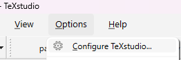

# Contributing
## Setting up LaTeX environment
1. Install [TeXstudio](https://www.texstudio.org/)
2. Install [MiKTeX](https://miktex.org/download)
3. In TeXstudio select the following build options in the configuration panel:

4. In TeXstudio open the `main.tex` file in `./MethodBooks/GuitarMethod_EN/` or `./MethodBooks/UkuleleMethod_EN/`
5. In TeXStudio press `Build & View` to generate the document preview. The first time TeXstudio might ask you to install to required packages.

To learn more about the LaTeX langauge see https://www.overleaf.com/learn/latex/Learn_LaTeX_in_30_minutes.

## Download draw.io

Some diagram are created in draw.io. The application can be downloaded from the website https://www.drawio.com/. You can also use the web-based application https://www.draw.io/.

The diagram are stored in [./DrawIO/](./DrawIO/).