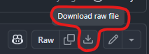
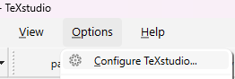
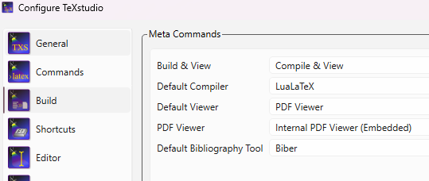
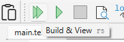

# Guitar & ukulele method

### Table of Contents  
- [Download method books](#download-method-books)
- [Listening to the (exercise) songs](#listening-to-the-exercise-songs)
    - [Installing MuseScore Studio](#installing-musescore-studio)
    - [Playing the exercises](#playing-the-exercises)
- [Contributing](#contributing)
    - [Setting up LaTeX environment](#setting-up-latex-environment)

---

## Download method books
- [Guitar (English)](./MethodBooks/GuitarMethod_EN/main.pdf)
    - Note: work in progress
- [Ukulele (English)](./MethodBooks/UkuleleMethod_EN/main.pdf)
    - Note: work in progress

The PDFs can be downloaded using this button at the top right:
    

## Listening to the (exercise) songs
All exercises are created with [MuseScore](https://musescore.org/en) (an open-source project: [git](https://github.com/musescore/MuseScore)), and all project files are saved in the [`./MuseScore`](./MuseScore/) folder.

### Installing MuseScore Studio
- Click the big "Free download" button on the [website](https://musescore.org/en).
    - This will install `MuseHub`
- In `MuseHub` search for `MuseScore Studio` and install it.
- DONE!

### Playing the exercises

- Download an exercise. For example [`./MuseScore/Guitar/Tetris_Simple_FirstPart.mscz`](./MuseScore/Guitar/Tetris_Simple_FirstPart.mscz)
    - A file can be downloaded using this button at the top right:
    
    

- Open `MuseScore Studio`
- Open the downloaded file:

- Now press the space-bar on the keybaord to play the tune.
- DONE!

To learn more about how to use `MuseScore`, have a look at these tutorials: https://musescore.org/en/tutorials.

## Contributing
### Setting up LaTeX environment
1. Install [TeXstudio](https://www.texstudio.org/)
2. Install [MiKTeX](https://miktex.org/download)
3. In TeXstudio select the following build options in the configuration panel:

4. In TeXstudio open the `main.tex` file in `./MethodBooks/GuitarMethod_EN/` or `./MethodBooks/UkuleleMethod_EN/`
5. In TeXStudio press `Build & View` to generate the document preview. The first time TeXstudio might ask you to install to required packages.

To learn more about the LaTeX langauge see https://www.overleaf.com/learn/latex/Learn_LaTeX_in_30_minutes.