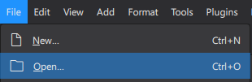

# Guitar & ukulele method

### Table of Contents
- [Method](#method)
    - [Download method books](#download-method-books)
- [Listening to the (exercise) songs](#listening-to-the-exercise-songs)
    - [Installing MuseScore Studio](#installing-musescore-studio)
    - [Playing the exercises](#playing-the-exercises)

---

## Method

The philosophy of this method is:
1. Expose you to new concepts so you have seen it, but not necessarily understand it yet.
2. Guided by exercises and songs, explain the previously shown concepts and how they work together.
3. Understand the theory of the concepts and be able to use them in playing.
4. Start at 1. again with new concepts.

### Download method books
- [Guitar (English)](./MethodBooks/GuitarMethod_EN/GuitarMethod_EN.pdf)
    - Note: work in progress
- [Ukulele (English)](./MethodBooks/UkuleleMethod_EN/UkuleleMethod_EN.pdf)
    - Note: work in progress

The PDFs can be downloaded using this button at the top right:
    

## Listening to the (exercise) songs
All exercises are created with [MuseScore](https://musescore.org/en) (an open-source project: [git](https://github.com/musescore/MuseScore)), and all project files are saved in the [`./MuseScore`](./MuseScore/) folder.

### Installing MuseScore Studio
- Click the big "Free download" button on the [website](https://musescore.org/en).
    - This will install `MuseHub`
- In `MuseHub` search for `MuseScore Studio` and install it.
- DONE!

### Playing the exercises

- Download an exercise. For example [`./MuseScore/Ukulele/UkuleleTetrisFull.mscz`](./MuseScore/Ukulele/UkuleleTetrisFull.mscz)
    - A file can be downloaded using this button at the top right:
    
    

- Open `MuseScore Studio`
- Open the downloaded file:

- Now press the space-bar on the keybaord to play the tune.
- DONE!

To learn more about how to use `MuseScore`, have a look at these tutorials: https://musescore.org/en/tutorials.